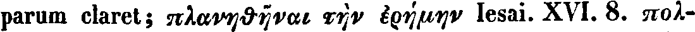

# OCR Ground Truth for Historical Commentaries

|        ID     | Commentator     | Year | Languages | Image source | Line example |
|---------------|-----------------|------|-----------|--------------|--------------|
| bsb10234118   | Lobeck [1]      | 1835 | Greek, Latin |BSB      | |
|sophokle1v3soph| Schneidewin [2] | 1853  | Greek, German | Internet Archive | |
| cu31924087948174 | Campbell [3]    | 1881  | Greek, English | Internet Archive |  |
| sophoclesplaysa05campgoog |Jebb [4] | 1896  | Greek, English | Internet Archive |  |
| Wecklein1894  | Wecklein  | 1894 [5] | Greek. German | internal |  |  

## Bibliographic references
- [1] 
- [2]   

----

## TODOs

- [ ] copy image and hOCR files for each commentary
- in the README add information about
    - source of digitized images
    - bibliographic information about each commentary
    - snippets with line images (one per commentary)